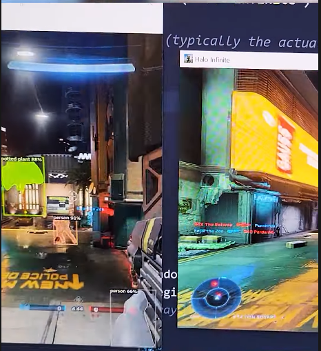
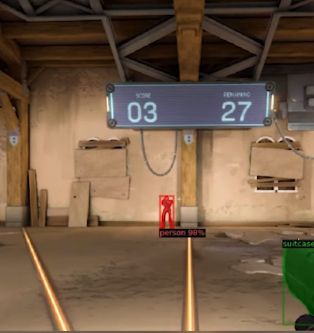
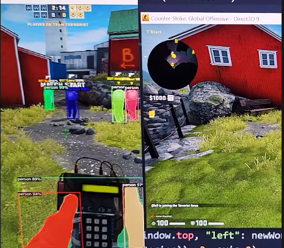

[](http://makeapullrequest.com)
# AI Aimbot - Massive Update

<p float="left">
    
     
    
</p>

## Table of Contents
- [AI Aimbot - Massive Update](#ai-aimbot---massive-update)
  - [Table of Contents](#table-of-contents)
  - [Intro](#intro)
  - [Known games that can identify it as a cheat](#known-games-that-can-identify-it-as-a-cheat)
  - [Configurable Settings](#configurable-settings)
  - [Current Stats](#current-stats)
  - [**Different Versions!!!**](#different-versions)
      - [**TensorRT Setup help**](#tensorrt-setup-help)
    - [REQUIREMENTS](#requirements)
    - [Pre-setup](#pre-setup)
    - [Run](#run)
  - [Community Based](#community-based)
    - [Add your own Model](#custom-models)
    - [Future Ideas](#future-ideas )

## Intro
AI Aimbot works in any game with humanoid characters and utilizes YOLOv5 (ultralytics/yolov5). Mouse movements don't work in Valorant currently. It is currently 100% undetectable to anti-cheat systems due to it being visual-only in nature. You could be found cheating if you are manually reported by another player and your game is reviewed manually due to the botty looking aimming of an Aimbot.

This is meant for educational purposed and to expose how poorly prepared game developers are with these new waves on AI based cheats. Please share with this with your friendly neighborhood game dev so they can start patching.

Code is all in 1 file for easy of viewing and learning from.

***Use at your own risk. If you get banned get rekted idiot***

**Adhere to our GNU licence, come on we are a nonprofit.**<br />
- free to use, sell, profit from, litterally anything you want to do with it
- **credit MUST be given to RootKit for the underlying base code**

Watch the tutorial video! - https://www.youtube.com/watch?v=TCJHLbbeLhg<br />
Watch the shorts video! - https://youtu.be/EEgspHlU_H0

Watch the live stream explainer - [https://www.youtube.com/RootKit](https://www.youtube.com/watch?v=uniL5yR7y0M&ab_channel=RootKit)<br />
Watch the pre-setup tutorial - Coming soon...<br />
Watch the main setup/run tutorial - Comming soon...<br />
Watch the onnx setup/run tutorial - Comming soon...<br />
Watch the tensorrt setup/run tutorial - Comming soon...

Join teh Discord - [discord.gg/rootkitorg](https://discord.gg/rootkitorg)

## Known games that can identify it as a cheat
Splitgate (discovered by ˞˞˞˞˞˞˞˞˞˞˞˞˞˞˞˞˞˞#2373 on discord 06/20/22)
EQU8 Detects win32 library for mouse movement

## Configurable Settings
*Default settings are good for most use cases. Read comments in code for more details.<br>
**CAPS_LOCK is the default for toggling on and off the autoaim functionality**

`videoGameWindowTitle` - (Legacy) Window title of the game you want to play. Does not need to be the complete window title.

`aaRightShift` - May need to be changed in 3rd person games like Fortnite and New World. Typically `100` or `150` will be sufficient.

`aaQuitKey` - Default is `q`, this may need to be changed to another key depending on the game.

`headshot_mode` - Make `False` if you want to aim more toward center mass.

`cpsDisplay` - Make `False` if you don't want the CPS to be displayed in the terminal.

`visuals` - Make `True` if you want to see what the AI sees. Can help with debugging issues.

`aaMovementAmp` - Default should be fine for 99% of use cases. Lower the value, the more smooth the autoaim will be. Recommended range is `0.5` - `2`.

`confidence` - Default should be kept unless you know what you are doing.

`screenShotHeight` - Default should be kept unless you know what you are doing.

`screenShotWidth` - Default should be kept unless you know what you are doing.

`aaDetectionBox` - Default should be kept unless you know what you are doing.

## Current Stats
This bot's speed is VERY dependent on your hardware. We will update the model it uses for detection later with a faster one.
Bot was tested on a:

    - AMD Ryzen 7 2700
    - 64 GB DDR4
    - Nvidia RTX 2080

We got anywhere from 15-60 corrections per second depending on the version used. All games were ran at 1920x1080 or close to it when testing.

ANYTHING dealing with Machine Learning can be funky with your computer. So if you keep getting CUDA errors, you may want to restart your PC in order to make sure everything resets properly.

## **Different Versions!!!**
The guide below starting with *Pre-Setup** will get the `main.py` version running, **BUT** the `main.py` IS THE SLOWEST!!!

Also there is a `custom` folder with user submitted models you can try out. Go explore them and see what you think. Make sure you shout out the dev if you like what they have done!

If you are comfortable with your skills, you can run the other 4 versions. You can also get AMD GPUs running the bot using the onnx version. This is advance stuff. **If you are not advance, skip to pre-setup below.** Python 3.9 is recommened if you are going to continue due to packages compatibility issues.

**EXPECT LITTLE TO NO HELP FROM STAFF IN REGARDS TO ANY OF THE ADVANCE SET UP UNLESS YOU ARE A PATREON MEMBER.** This includes openning issues. If you are opening an issue, give full content including but not limited to OS, GPU, RAM, Toolkit version, cuDNN version, tensorRT version, etc.

`main_torch_gpu.py` will be the easiest to get running. You just need to install pip install `cupy` based on your CUDA Toolkti version. This can give up to a 10% performance boost.

`main_onnx_cpu.py` is for those of you who don't have a nvidia CPU. It will be optimized for CPU based compute. You need to `pip install onnxruntime`.

`main_onnx_nvidia.py` will give you up to a 100% performance boost. You will need to pip install `pip install onnxruntime-gpu`.

`main_onnx_amd.py` will give you up to a 100% performance boost. You will need to run `pip install -r requirements_onnx_amd.txt`. 

`main_tensorrt_gpu.py` is the BEST. It gives over a 200% performance boost. 
#### **TensorRT Setup help**
In our testing, the screenshot engine was the bottleneck. Tensorrt is only available via download from NVIDIA's site.

You will need to make an account. Just go to this link and get `TensorRT 8.5 GA Update 2`. https://developer.nvidia.com/tensorrt You will need to install it via the .whl file they give you. You may also need https://developer.nvidia.com/cudnn.

Sometimes you will need to remake the .engine model. To do this you need to visit the [YoloV5's Github repo](https://github.com/ultralytics/yolov5) and download it. Then execute the `export.py` script in the repo with the command below. This can take up to 20 minutes and have no visual feedback. It's not frozen, just looks like it.

NOTE, you will need to use the provided or download a new version of the yolov5 weights (aka the .pt file). We use the small model, but with tensorrt, you should be able to use a larger model. 

`python .\export.py --weights ./yolov5s.pt --include engine --half --imgsz 320 320 --device 0`

### REQUIREMENTS
- Nvidia RTX 2050 or higher
- One of the following
  - Nvidia CUDA Toolkit 11.6 (Most compatibility) (https://developer.nvidia.com/cuda-11-6-0-download-archive)
  - Nvidia CUDA Toolkit 11.7 (No onnx support currently, faster) (https://developer.nvidia.com/cuda-11-7-0-download-archive)

### Pre-setup
1. Unzip the file and place the folder somewhere easy to access

2. Make sure you have a pet Python (aka install python, use 3.10) - https://www.python.org/

***IF YOU GET THE FOLLOWING ERROR `python is not recognized as an internal or external command, operable program, or batch file` Watch This: https://youtu.be/E2HvWhhAW0g***

***IF YOU GET THE FOLLOWING ERROR `pip is not recognized as an internal or external command, operable program, or batch file` Watch This: https://youtu.be/zWYvRS7DtOg***

3. (Windows Users) Open up either `PowerShell` or `Command Prompt`. This can be done by pressing the Windows Key and searching for one of those applications.

4. To install `PyTorch` go to this website, https://pytorch.org/get-started/locally/, and Select the stable build, your OS, Pip, Python and CUDA version you installed. Then select the text that is generated and run that command.


6. Copy and paste the commands below into your terminal. This will install the Open Source packages needed to run the program. You will need to `cd` into the downloaded directory first. Follow step 2 in the Run section below if you need help.
```
pip install -r requirements.txt

pip install --index-url https://test.pypi.org/simple/ --extra-index-url https://pypi.org/simple dxcam
```

### Run
If you have python and the packages you are good to go. Load up any game on your MAIN monitor and load into a game.

1. (Windows Users) Open up either `PowerShell` or `Command Prompt`. This can be done by pressing the Windows Key and searching for one of those applications.

2. Type `cd ` (make sure you add the space after the cd or else I will call you a monkey)

3. Drag and drop the folder that has the bot code onto the terminal

4. Press the enter key

5. Type `python main.py`, press enter.

6. Use CAPS_LOCK to toggle on and off the autoaim functionality. **It is off by default**

7. Pressing `q` at anytime will completely quit the program

## Community Based
We are a community based nonprofit. We are always open to pull requests on any of our repos. You will always be given credit for all of you work. Depending on what you contribute, we will give you any revenue earned on your contributions 💰💰💰!

**We are always looking for new Volunteers to join our Champions!
If you have any ideas for videos or programs, let us know!**

### Custom Aimbots
If you have some new functionality you have added to the bot you would like to show off and have people learn from, put it in here and send a Pull Request!

Just add a folder to the `customScripts` folder with your github name and inside put your all your code and a `readme.md` explaining what they are and what they do.

For an example, look at the `example-user` folder in `customScripts`.

### Custom Models
If you trained your own model, then submit a PR with it!

Just add a folder to the `customModels` folder with your github name and inside put your `model(s)` and a `readme.md` explaining what they are and how you made them.

For an example, look at the `example-user` folder in `customModels`.

Another view of the layout - 

```
/custom/
  exampleUsername/
    model_general.pt
    readme.md
```
### Future Ideas    

 - [ ] Config File Instead of hardcoded values

 

 


